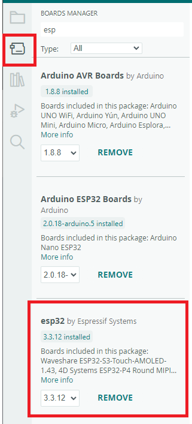
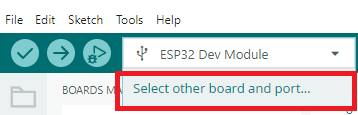
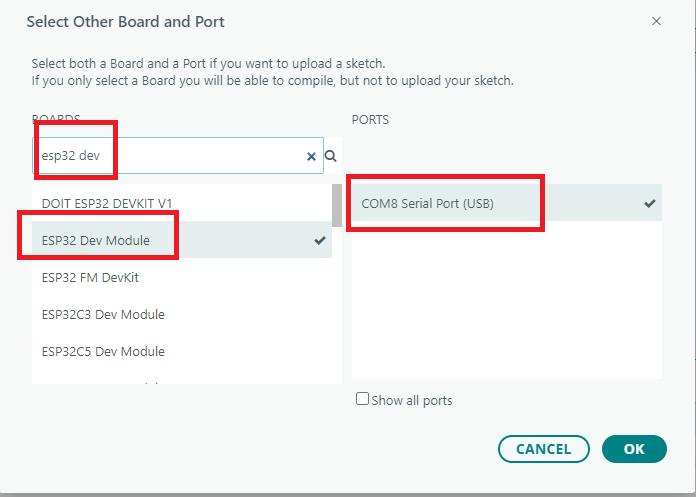
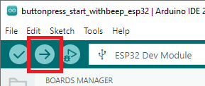
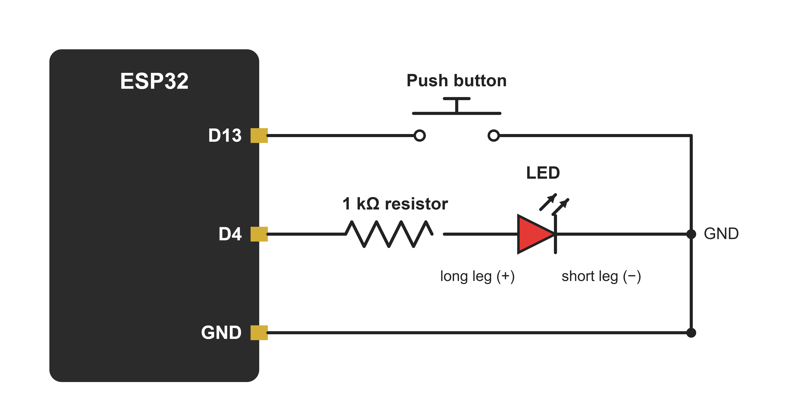

# AmgLabCommanderActivator
A set of Arduino apps for use with the AmgLab Commander Timer for use in Practical Competition Shooting sports events.

## Minimum Equipment Requirements
- An AmgLab Commander
- Arduino/ESP32 with Bluetooth(code and libraries change by what model you use). [Elegoo ESP-32](https://a.co/d/07qBuuz8) that I used to develop project
- 1x 1kOhm resistor
- An LED
- A button

## Projects
### buttonpress_start_withbeep
Hit the button to start the timer.

### buttonpress_start_beepless
Hit the button to start the timer, but it won't make a sound.

### Visual Start
A visual indicator that the Course Of Fire has started. Does not beep the timer.

### Delayed Activator
A mechanism for the Timer to activate the Arduino, which then performs a series of actions in a delayed fashion (like starting a swinger 5s after the beep)

### Others
These projects can be extended to do various actions, they don't need to just need to do the one action they come with. The Visual Start could be mixed with the Delayed Activator, they could activate 3 different actions not just one.

## How To
- Clone this repo
- Open one of the `.ino` in Arduino Studio
- Install the `esp32 by Expressif Systems` boards under `Board Manager`

- Plug in your arduino. Open the device selector and click "select board and port"

- Find `ESP32 Dev Module` and the COM port of your board.

- If your board isn't found, you'll need to [install the CP210x Driver](https://www.silabs.com/software-and-tools/usb-to-uart-bridge-vcp-drivers?tab=downloads)
- Edit the `TARGET_TIMER_NAME` address to your timer(just the 4 digits) (docs/timeraddress.png)
- Upload the sketch

- Connect a button to `pin 12` and ground. Connect the short leg of an LED to ground. Conned the long leg of the LED to a 1kOhm Resistor and other side of the resistor to `pin 13` (simple block wiring diagram here)

- Put in an enclosure and supply power as you wish
